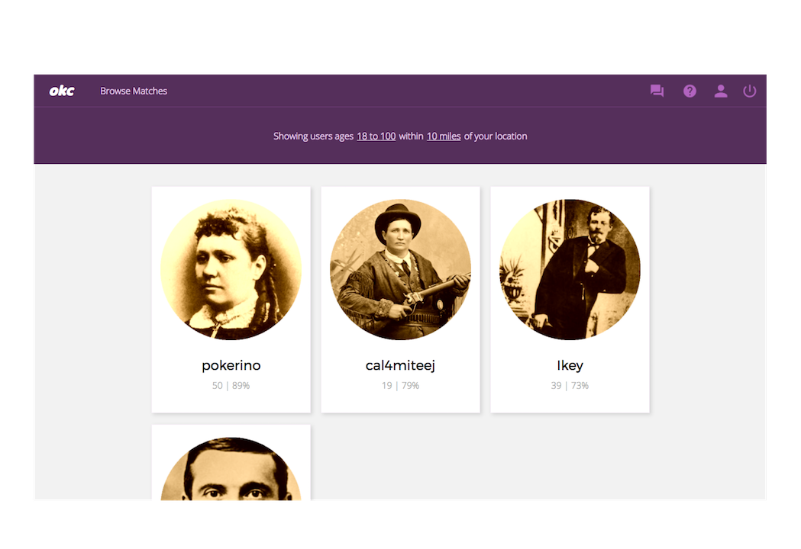
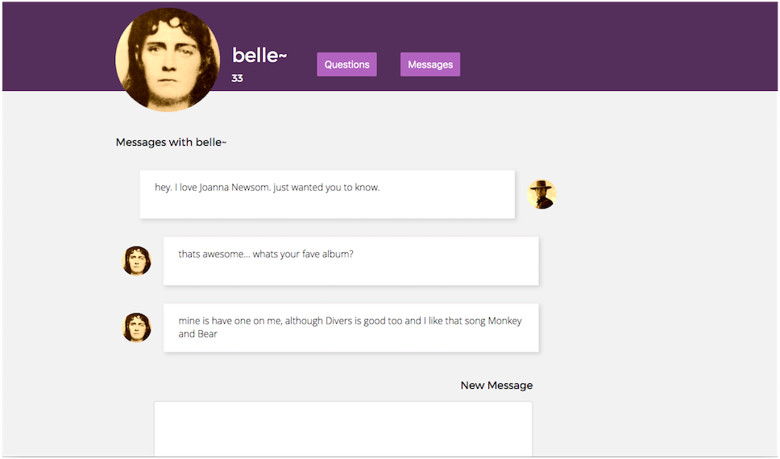

# OKCorral

[Demo](https://okcorral.herokuapp.com)


## Abstract

Howdy.

OKCorral is, at its core, a clone of OKCupid built on Rails using React/Redux to handle the frontend. However, it includes several interesting design tweaks.

CSS hover interactions make the interface feel subtly bouncier. Mouse movement is more deliberate and meaningful—in short, OKCorral responds to your touch. I made these changes hoping that a more playful, responsive mode of interaction would lead to a kinder, more easygoing attitude toward online dating.

All of the hallmark features of OKCupid are here—users can answer matching questions, filter matches based on distance and age, and view and message matches that interest them. It will be interesting to see how the perception of these features changes with my updated design language. Hopefully, OKCorral is light, fun, and satisfying to play with.



## Index

On the Index page of the app, users can view potential matches based on their stated sexual preferences, location, and accepted ages. Matches are sorted based on match percentage. Match percentage is determined via a matching algorithm, which we'll be covering in the 'questions' section. All matching calculation is handled on the frontend—the backend stores questions and answers, but doesn't calculate matching scores.

## Profile

Depending on whether the profile page represents the logged-in user, the profile image and response fields are editable. For other users, links are available to their answered questions and messaging.

## Questions

On the Questions page, users are asked matching questions. They decide on an answer for themselves, determine which answers they'd prefer a match chooses, and then decide how important the question is to them on a ternary scale.

The matching algorithm then determines a match percentage as follows:

First, it determines the number of questions the users have answered in common. Then, for each common answer, it determines whether a user has given an unacceptable answer. If a user has given an unacceptable answer, it subtracts a percentage from the potential maximum match (100%). This subtracted percentage is proportional to the number of answers in common (if there are fewer answers in common, each answer carries more weight) and the importance the user placed on the question.

This approach is, perhaps, optimistic (everyone starts at 100% if they have a single answer in common and no conflicts) but gives people the benefit of the doubt—innocent until proven guilty, if you like.

```javascript

commonAnswers.forEach((answerPair) => {
  if (!answerPair[0].accepted_answers.includes
        (answerPair[1].answer_num.toString())) {
            myMatch = (myMatch - (50/numberInCommon/answerPair[0].importance)
        );
  } else if
      (!answerPair[1].accepted_answers.includes
        (answerPair[0].answer_num.toString()))
            theirMatch = (theirMatch - (50/numberInCommon/answerPair[1].importance)
        );
})

return (Math.round(myMatch + theirMatch));

```




## Dialogues and Messages

On the Message Index, users can view all of their dialogues with potential matches. Clicking will take them to their message history, shown above.
